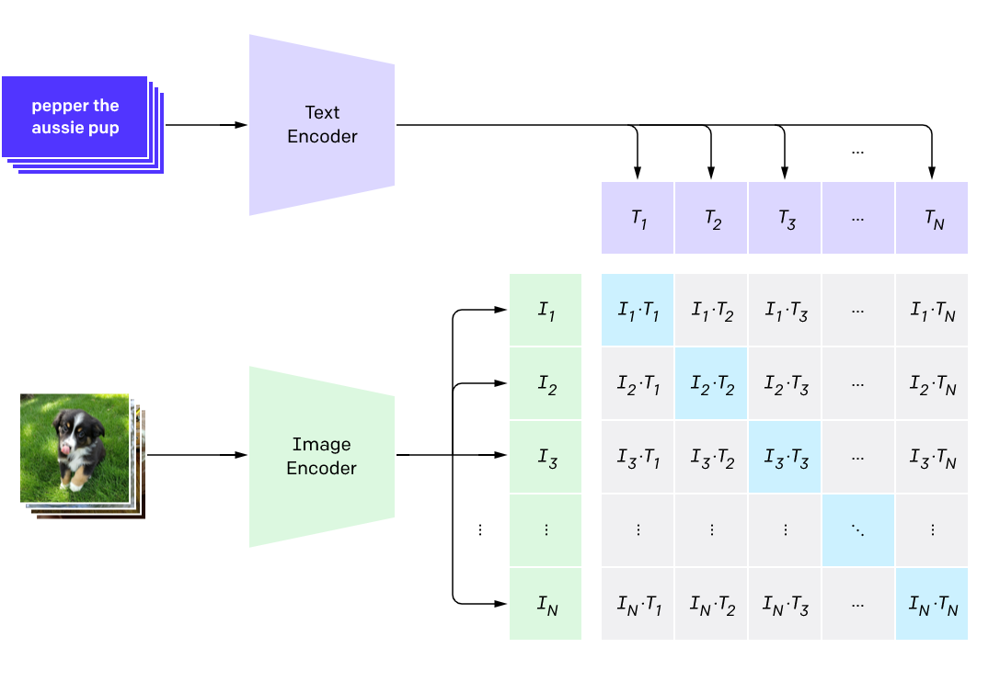

## CLIP

本项目包含了在 Google Conceptual Caption 数据集上训练 CLIP 模型的代码，我们在 ImageNet 验证集上做 zero-shot 分类，能够达到 37.22% 的 Top-5 准确率。



## Requirements

- torch >= 1.8
- [hfai](https://doc.hfai.high-flyer.cn/index.html)
- [ffrecord](https://github.com/HFAiLab/ffrecord/)

## Train

在萤火二号集群上运行：

```shell
hfai python train.py -- -n 8 -p 30
```

本地运行：

```shell
python train.py
```

## Result

在 ImageNet1k 验证集上的 zero-shot 分类结果:

| model    | Acc@1  | Acc@5  |
|----------|--------|--------|
| RN50     | 19.32% | 37.22% |


## hfai DDP & hfai.nn.to_hfai

### 1. hfai DDP

我们比较在 8 个计算节点，64 块 GPU 上训练 100 个 step 所消耗的时间，用的模型是 `clip_rn50`，batch size 设为 64

| hfai ddp  | time (s)  | performance  |
| --------- | --------- | ------------ |
| No        | 49.68     | 100%         |
| Yes       | 40.71     | 122%         |

我们可以看到，使用了 `hfai DDP` 后训练速度有显著提升，相比于原来能够提升 22 %。


### 2. hfai.nn.to_hfai

接下来我们在 `clip_vit_b16` 模型上比较使用 `hfai.nn.to_hfai` 之后的性能，batch size 设为 64：

- PyTorch: 原始模型
- HFAI：使用 `hfai.nn.to_hfai` 之后的模型

| measurement  | PyTorch (ms) | HFAI (ms)  | PyTorch / HFAI  |
| ------------ | ------------ | ---------- | --------------- |
| forward      | 78.65        | 75.45      | 104.25 %        |
| backward     | 141.96       | 117.91     | 120.40 %        |
| fwd + bwd    | 220.62       | 193.36     | 114.10 %        |

我们可以看到，使用了 `hfai.nn.to_hfai` 后训练速度有显著提升，forward + backward 相比于原来能够提升 14 %。


## Citation

```
@inproceedings{radford2021learning,
  title={Learning transferable visual models from natural language supervision},
  author={Radford, Alec and Kim, Jong Wook and Hallacy, Chris and Ramesh, Aditya and Goh, Gabriel and Agarwal, Sandhini and Sastry, Girish and Askell, Amanda and Mishkin, Pamela and Clark, Jack and others},
  booktitle={International Conference on Machine Learning},
  pages={8748--8763},
  year={2021},
  organization={PMLR}
}
```
