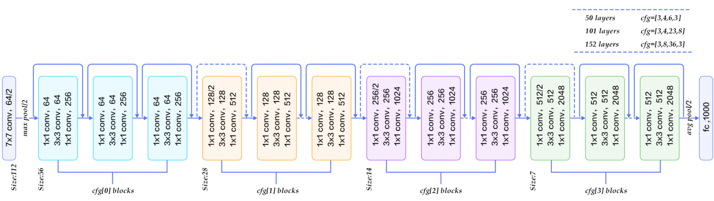

# ResNet

本项目实现了论文 《Deep Residual Learning for Image Recognition》



## Requirements

- torch >= 1.8
- torchvision
- hfai (to be released soon)
- [ffrecord](https://github.com/HFAiLab/ffrecord/)

## Train

在萤火二号集群上运行：

```shell
hfai python train.py -- -n 1 -p 30
```

本地运行：

```shell
python train.py
```

## Result

训练 100 个 epoch，验证集 Top-1 准确率和 Top-5 准确率如下。

| model       | Top-1       | Top-5       |
| ----------- | ----------- | ----------- |
| ResNet-50   | 75.53%      | 92.66%      |

## Citation

```
@inproceedings{he2016deep,
  title={Deep residual learning for image recognition},
  author={He, Kaiming and Zhang, Xiangyu and Ren, Shaoqing and Sun, Jian},
  booktitle={Proceedings of the IEEE conference on computer vision and pattern recognition},
  pages={770--778},
  year={2016}
}
```
